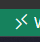
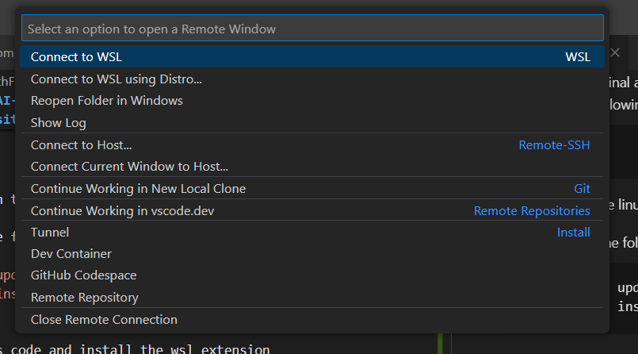

# PathFinder-AI-Enhanced-Resumes
Course Project for DA213

#### Prerequisites
One of libraries used in our project - FAISS, is only available on linux so you'll have to setup the Windows Subsystem for Linux to make to it work or simply run this program in linux. Following this are the steps to do:

1. Open terminal/command prompt on your pc with "run as administrator"
2. Run the following commands:
```
wsl --update
wsl --install -d ubuntu
```

3. It'll probably ask you to restart at this point so do that.
4. Open terminal again through the same method.
5. Run the following command:
```bash
    wsl
```
it should open the linux terminal

6. Now run the following commands:
```bash
    sudo apt update && sudo apt upgrade
    sudo apt install python3-pip python3-dev
```

7. Now open vs code and install the wsl extension
8. click on the following icon at the bottom left:



it should display the following pop-up:



9. Now click on "Connect to WSL". It'll open a new vs code window. open terminal with the hotkey "Ctrl+shift+~" and you should see the linux terminal.

10. run the following commands to create a folder for your project:
```bash
    mkdir python-project
    cd python-project/
```

11. now run:
```bash
    sudo apt install gh
    gh auth login
```
follow the steps, should be obvious enough and authenticate your github credentials

12. Now run the following command in the terminal:
```bash
    git clone https://github.com/himanshu-skid19/PathFinder-AI-Enhanced-Resumes.git
    cd PathFinder-AI-Enhanced-Resumes
```

13. If it doesnt say "WSL: Ubuntu" at the bottom left run:
```bash
    code .
```

and it should open a new vs code window with the directory open.

14. You are now all set, just run:
```bash 
    pip install -r requirements.txt
```
and the program would be ready to run

15. To start the program run:
```bash
    python3 -m streamlit run app.py
```


## Steps to Run
1. Download the following folder and store it in the root directory:
https://drive.google.com/drive/folders/1ScKo5OcaQbt-q0QgwNuSJ2y1bB2hEdEy?usp=sharing
Make sure the folder is named as "resumes".

2. Ensure python is install in your system
3. Execute the following commands:
```
    pip install -r requirements.txt
    python3 -m streamlit run app.py
```
4. Open http://localhost:8501/


## Project Architecture
```
├── README.md
├── app.py
├── create_vector_store.py
├── iitg_template.py
├── image-1.png
├── image.png
├── imports.py
├── latex_template.py
├── llm.py
├── output.log
├── output.tex
├── prompts.py
├── read_data.py
├── requirements.txt
└── test_data.py
```

## Team Members

1. Himanshu Singhal - [@himanshu-skid19](https://github.com/himanshu-skid19)
2. Rishita Agarwal - [@rishita3003](https://github.com/rishita3003)
3. Arushi Kumar - [@ArushiKumar11](https://github.com/ArushiKumar11)
